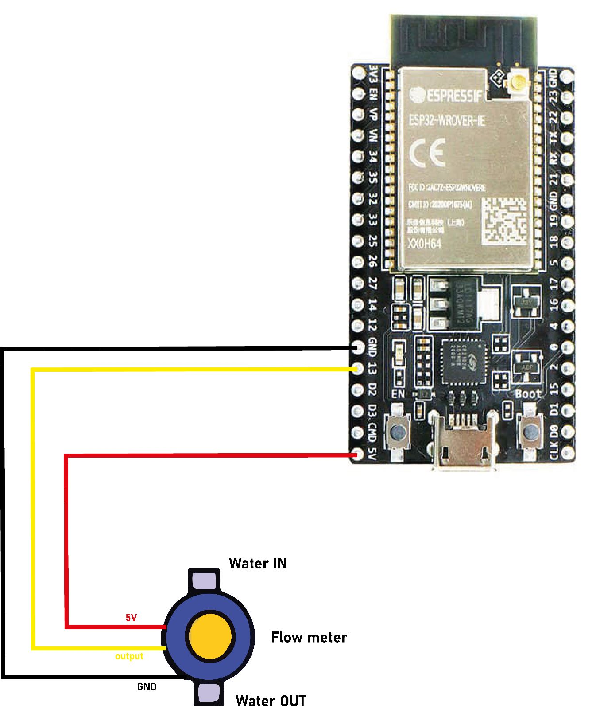

# sugar-network-tub-prototype

This prototype was developed to extract data from a car's fuel pip using a flow meter and send it to the cloud through HTTP. This is just a proof of concept, how it is sent through the cloud can easily be edited.

A esp32 was used in this project. Its function is to extract the data from the flow meter (that's inside the car fuel pipe) and send it through wifi to the internet.

To run this project, open `ESP32-wifi-connection.ino` with ArduinoIDE and flash an esp32 with it.

For the purpose of this prototype, connection to a webflow server was estabilished to visualize the amount of fuel that entered a car in real time. This is parameterized and can be edited in the source code.

The schematics to run this are as follows:

